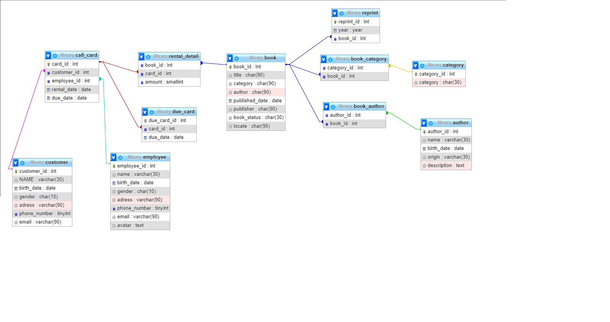

Xây dựng database quản lý thư viện, biết:


Sách(id, tên, số trang, thể loại, tác giả, năm xuất bản, nhà xuất bản, tính trạng, vị trí)
```sql
CREATE DATABASE library

CREATE TABLE book (
    book_id INT PRIMARY KEY,
    title CHAR(90) NOT NULL,
    category CHAR(90) NOT NULL,
    author CHAR(90),
    published_date DATE,
    publisher CHAR(90),
    book_status CHAR(30) NOT NULL,
    locate CHAR(30) NOT NULL
    )
```


Thể loại(id, tên thể loại)
```sql
CREATE TABLE category(
    category_id INT PRIMARY KEY,
    category CHAR(30)
)
```


sách_thể loại(id_sách, id_thể loại)

```sql
CREATE TABLE book_category(
    category_id int, book_id int,
    FOREIGN KEY (category_id) REFERENCES category(category_id),
    FOREIGN KEY (book_id) REFERENCES book(book_id)
)
```

Tác giả(id, tên , ngày sinh, quê quán, mô tả)

```sql
CREATE TABLE author(
    author_id INT PRIMARY KEY,
    name VARCHAR(30) NOT NULL,
    birth_date DATE,
    origin VARCHAR(30),
    description TEXT
)

```

sách_tác giả (id sach, id tác giả)

```sql
CREATE TABLE book_author(
    author_id INT,
    book_id INT,
    FOREIGN KEY(author_id) REFERENCES author(author_id),
    FOREIGN KEY(book_id) REFERENCES book(book_id)
)

```

Tái bản(id, id_sách, năm)

```sql
CREATE TABLE reprint (
    reprint_id INT PRIMARY KEY,
    year YEAR,
	book_id INT,
    FOREIGN KEY (book_id) REFERENCES book(book_id)
)

```

Phiếu mượn(id, id_độc giả, id_nhan viên, ngày mượn, ngày hẹn trả )

```sql
CREATE TABLE call_card(
    card_id INT PRIMARY KEY,
    customer_id INT,
    employee_id INT,
    rental_date DATE NOT NULL,
    due_date DATE NOT NULL,
    FOREIGN KEY(customer_id) REFERENCES customer(customer_id),
    FOREIGN KEY(employee_id) REFERENCES employee(employee_id)
)

```

Chi tiết mượn(id_phiếu mượn, id sách, số lượng)

```sql
CREATE TABLE rental_detail(
    book_id INT,
    card_id INT,
    amount SMALLINT NOT NULL,
    FOREIGN KEY( card_id) REFERENCES call_card( card_id),
    FOREIGN KEY(book_id) REFERENCES book(book_id)
)
```

Độc giả(id, tên , ngày sinh, giới tính, địa chỉ, sđt, email)

```sql
CREATE TABLE customer(
    customer_id INT PRIMARY KEY,
    NAME VARCHAR(30) NOT NULL,
    birth_date DATE NOT NULL,
    gender CHAR(10),
    adress VARCHAR(90) NOT NULL,
    phone_number TINYINT NOT NULL,
    email VARCHAR(90)
)

```

Nhân viên(id, tên , ngày sinh, giới tính, địa chỉ, sđt, email, avatar)

```sql
CREATE TABLE employee(
    employee_id INT PRIMARY KEY,
    name VARCHAR(30) NOT NULL,
    birth_date DATE NOT NULL,
    gender CHAR(10) NOT NULL,
    adress VARCHAR(90) NOT NULL,
    phone_number TINYINT NOT NULL,
    email VARCHAR(90) NOT NULL,
    avatar text NOT NULL
)

```

Phiếu trả(id, id phiếu mượn, ngày trả)

```sql
CREATE TABLE due_card(
    due_card_id INT PRIMARY KEY,
    card_id INT,
    due_date DATE NOT NULL,
    FOREIGN KEY(card_id) REFERENCES call_card(card_id)
)

```

result 

